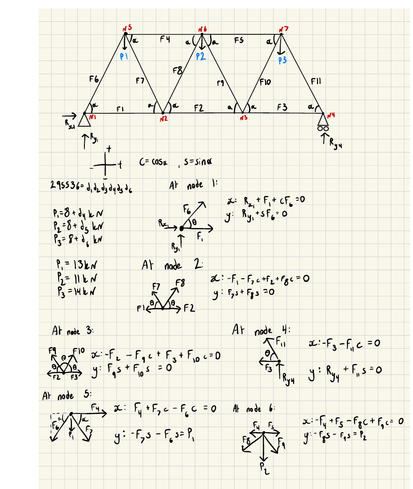
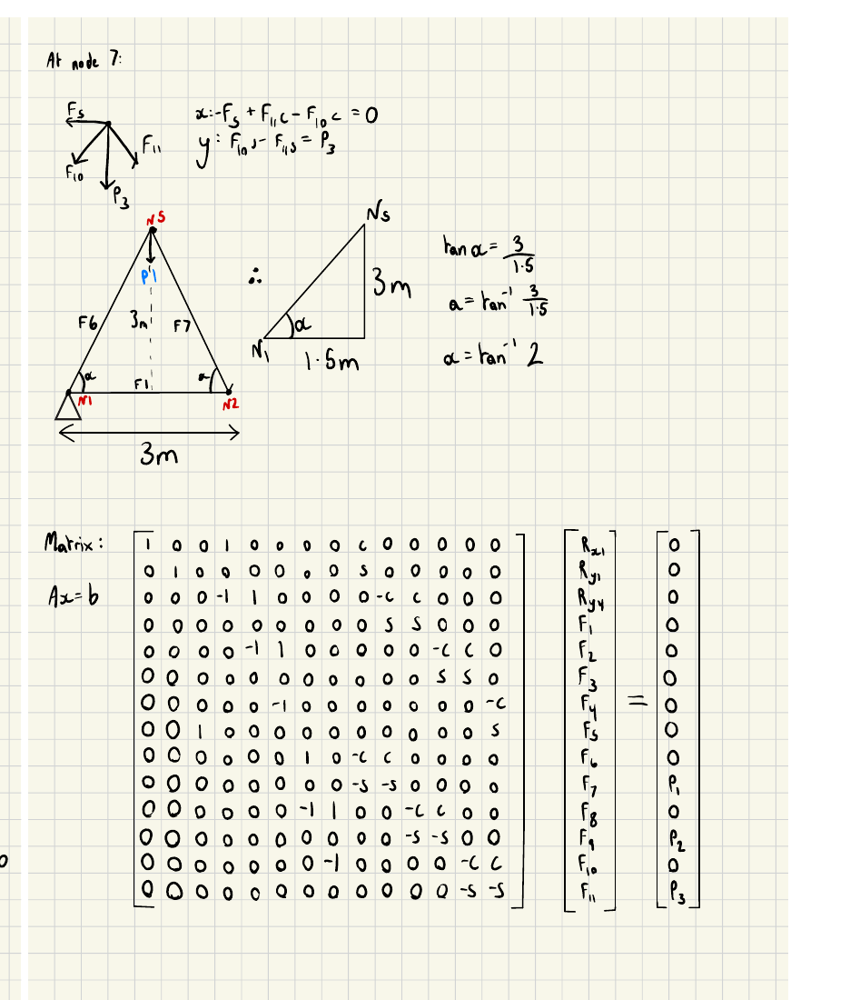
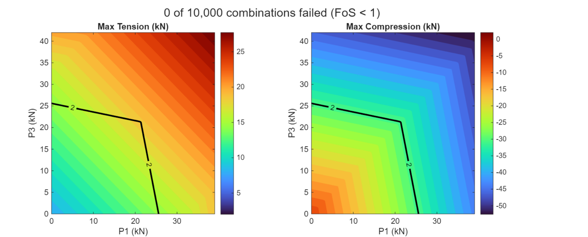
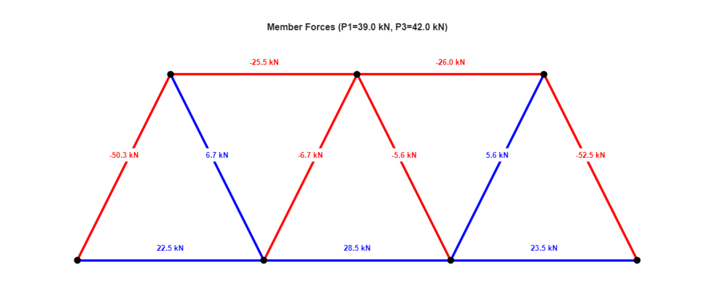
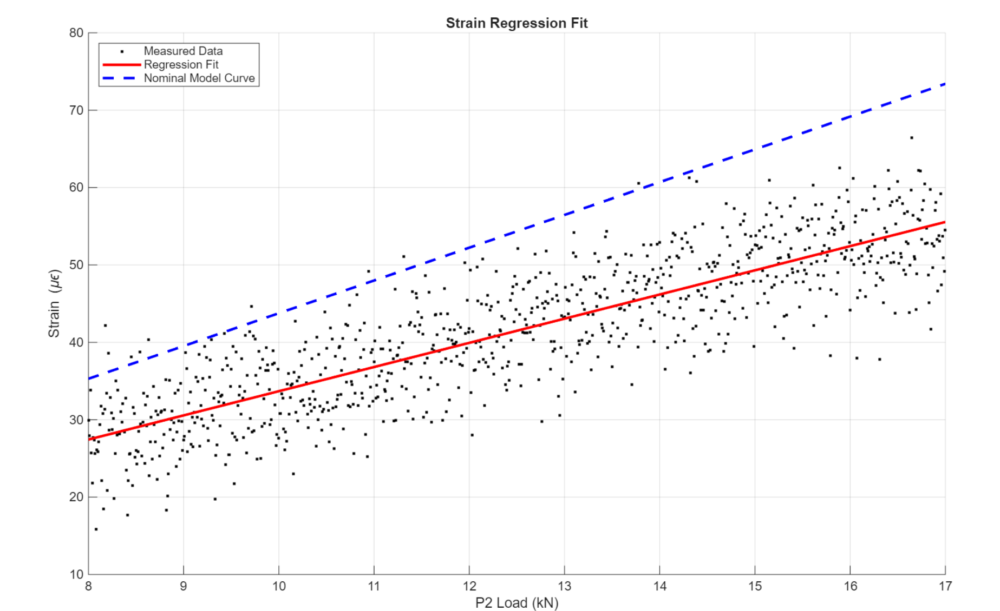
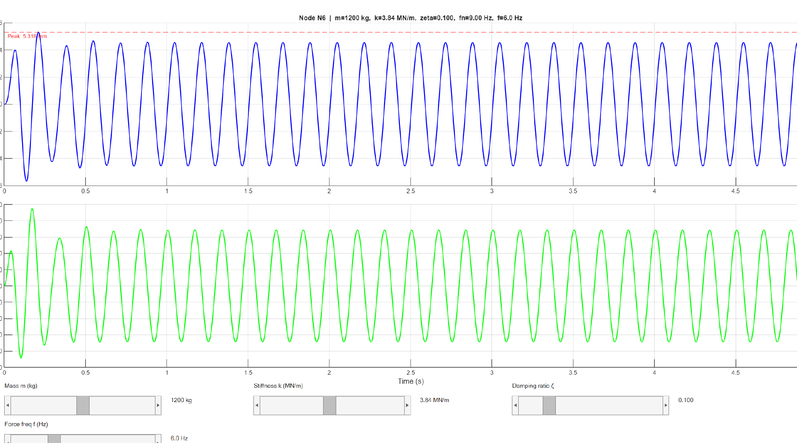

# Warren Truss — Numerical Modelling Portfolio

A five-stage MATLAB project where I took a simply-supported Warren truss
(used as an equipment gantry) from a hand-derived static solver through to
a calibrated, parametrically-swept, dynamically-simulated structural
model. Individual university coursework — every line of MATLAB and every
hand calculation here is mine.

The brief's own framing was to move "from simple *solvers* to *modellers
and analysts*," and that's genuinely what the five stages force you to
do: derive equilibrium by hand once, then build it into a function you
can call 10,000 times, calibrate it against noisy real-world-style data,
extract energy/stiffness from it, and finally drive it as a dynamic
system. I think it's a reasonable proxy for how a structural analysis
tool actually gets built in practice, just compressed into one term.

## TL;DR — key results

| Stage | What I did | Headline result |
|---|---|---|
| 1. Static solver | Hand-derived 14×14 equilibrium system, solved with `A\b` | Most loaded member: **F11, −21.6 kN compression** |
| 2. Parametric sweep | 10,000-combination load sweep (P1, P3 each 0→+200%) | **0 of 10,000 failed** — min FoS = **1.14** at the extreme corner |
| 3. Calibration & root-finding | Fit noisy strain data, calibrated diagonal area, secant root-find | Calibrated area **+35.5%** vs nominal; critical load **P2\* = 191.7 kN** |
| 4. Strain energy | Trapezoidal integration (n=50) vs. closed-form, Castigliano stiffness | U = **0.0199 kN·m**; N6 deflection **1.47 mm** |
| 5. Dynamic response | State-space ODE, solved with `ode45`, 5 s simulation | Peak displacement **5.32 mm**, sub-resonant (f/fₙ = 0.67) |

Full numeric breakdown: [`calculations/force-table.md`](calculations/force-table.md)

## What I did

### 1. Derive the static solver by hand

Starting from the truss geometry (7 joints, 11 members, pin + roller
supports, three point loads), I drew the free-body diagram for every
joint and wrote out ΣFx = 0 / ΣFy = 0 by hand — 14 equations for 14
unknowns (3 reactions + 11 member forces). The brief specifically
required this to be done manually, not auto-assembled from coordinates,
so I transcribed coefficients straight from the hand-derived equations
into a 14×14 matrix `A` and solved `x = A\b` directly in MATLAB (no
`inv(A)` — direct solve is both faster and more numerically stable for a
system like this).

 

I checked the result against three independent global equilibrium
conditions (ΣFy, ΣFx, moment about the pin support) before trusting any
of the individual member forces.

Full derivation: [`calculations/static-equilibrium-derivation.md`](calculations/static-equilibrium-derivation.md)

### 2. Turn it into a function, sweep the design space

Once the hand-derived system was validated, I rebuilt it as a reusable
MATLAB function and used it to sweep P1 and P3 across 100×100 = 10,000
combinations (0 → +200% of baseline), tracking the worst-case
tension/compression and Factor of Safety at every single point in that
grid — not just the headline worst case, but the full surface, so I could
see *where* the safety margin actually drops off rather than just *that*
it does somewhere.



For the higher-marks extension I went further than a static plot and
built an interactive truss viewer with live sliders for P1 and P3, that
redraws the whole truss and re-colours/annotates every member by
tension/compression in real time as you move the sliders:



Full working: [`calculations/parametric-design-space.md`](calculations/parametric-design-space.md)

### 3. Calibrate against noisy "experimental" data

Each candidate was given a unique synthetic dataset simulating noisy
strain-gauge readings from a physical scale model. I fit a regression
line to the strain data, used Hooke's law to back-solve for a calibrated
cross-sectional area of the diagonal member (rather than the simpler
"just scale the force by a factor" route — see
[`docs/concept-design.md`](docs/concept-design.md) for why I picked the
harder option), then used the secant method to extrapolate the load at
which that member would reach its allowable stress.



Full working: [`calculations/calibration-and-root-finding.md`](calculations/calibration-and-root-finding.md)

### 4. Strain energy and equivalent stiffness

Computed strain energy per member from the Problem 1 forces, deliberately
using numerical (trapezoidal) integration even though the constant-force
case has an exact closed form — the point was to build the pattern you'd
need for a real FEA-style calculation, and I ran both side by side so the
comparison is actually meaningful rather than just claimed. Used
Castigliano's second theorem (via finite differences) to extract the
deflection at the loaded joint, and from that an equivalent global
stiffness.

Full working: [`calculations/strain-energy.md`](calculations/strain-energy.md)

### 5. Drive it as a dynamic system

Converted the governing 2nd-order ODE (mass-spring-damper, representing
the truss's vertical response at the loaded joint) into a first-order
state-space system by hand, then solved it numerically with `ode45` under
sinusoidal forcing for a 5-second window. Built an interactive version of
this too, with live sliders for mass, stiffness, damping ratio, and
forcing frequency, so you can actually feel the system move from
sub-resonant towards resonance as you drag the frequency slider.



Full working: [`calculations/dynamic-response.md`](calculations/dynamic-response.md)

## What actually happened (the honest version)

Nothing here "failed" in the sense of a test result missing a target —
the truss stayed safe across the entire swept design space, and the
numerical methods matched their analytical/closed-form checks closely.
But there are a few places where the result needs a more careful read
than the headline number suggests, and I'd rather put those front and
centre than let them sit quietly in an appendix:

- **The Problem 4 "0% numerical integration error" isn't really testing
  what it looks like it's testing.** The trapezoidal rule integrates a
  constant function exactly regardless of how many points you use,
  because this truss has constant axial force along each member. The
  near-zero error confirms my code is bug-free, not that trapezoidal
  integration is accurate in general — a genuinely interesting accuracy
  test would need a member with non-constant force or varying
  cross-section, which a simple pin-jointed truss under static point
  loads doesn't give you. I called this out explicitly rather than
  presenting the clean result as if it proved more than it does.
- **The Problem 3 calibration result is bigger than I'd want to act on
  without caveats.** The calibrated diagonal area came out 35.5% larger
  than the nominal spec (894.6 mm² vs. 660 mm²) — a real, substantial gap,
  not a rounding correction. I can't fully separate "the real member is
  genuinely bigger than spec" from "some of this is uncorrected strain
  gauge bias" using a single regression fit, and I say so directly in the
  writeup rather than reporting the calibrated number as if it were
  unambiguous ground truth.
- **The root-finding result extrapolates a long way past the data it's
  based on.** The critical load (191.7 kN) is found by linear
  extrapolation from a regression fit built on 8–17 kN of measured data —
  more than 10× past the edge of the calibration range. The maths is
  correct and the secant method converges in exactly 2 iterations (which
  is a genuine, explainable result for a linear system, not a fluke), but
  I wouldn't want anyone reading just the final number to think 191.7 kN
  is as trustworthy as, say, the Problem 1 baseline result, which is
  interpolation-free.
- **Two stiffness values that look like they should match, don't, and
  that's correct, not a bug.** Problem 4's Castigliano-derived stiffness
  and Problem 5's dynamic-model stiffness are independent quantities from
  different parts of the brief's own parameterisation — I flagged this
  explicitly in both calculation docs so it doesn't read as an
  inconsistency I missed.

If you only read one of the calculation docs, I'd point you at
[`calculations/calibration-and-root-finding.md`](calculations/calibration-and-root-finding.md) —
it's where the most genuinely judgement-dependent call in the whole
portfolio gets made (and explained).

## Repo structure

```
.
├── README.md                              ← you are here
├── LICENSE
├── docs/
│   ├── project-brief.md                   ← clean summary of the original assignment
│   └── concept-design.md                  ← modelling/method choices, what I rejected and why
├── calculations/
│   ├── static-equilibrium-derivation.md   ← Problem 1: hand-derived matrix system
│   ├── parametric-design-space.md         ← Problem 2: 10,000-combination sweep
│   ├── calibration-and-root-finding.md    ← Problem 3: regression calibration + secant method
│   ├── strain-energy.md                   ← Problem 4: trapezoidal integration + Castigliano
│   ├── dynamic-response.md                ← Problem 5: state-space ODE + ode45
│   └── force-table.md                     ← consolidated results table, all 5 problems
├── images/                                ← cropped figures (hand calcs, plots, reference photo)
└── report/
    └── full-report.pdf                    ← original submitted report, untouched, with all MATLAB code
```

All MATLAB source code is reproduced in full inside
[`report/full-report.pdf`](report/full-report.pdf) (one listing per
problem) rather than duplicated as loose `.m` files in this repo, since
the report is the actual graded submission and I wanted a single source
of truth rather than two copies that could drift apart.

## Why this matters

Warren trusses like this one show up anywhere you need a stiff,
lightweight span supported only at two ends — pedestrian bridges, crane
gantries, and (the brief's own reference image) monorail support
structures like the one below, in Chiba, Japan:


*([source](https://commons.wikimedia.org/wiki/File:Chiba_Monorail,_Truss_Bridge.jpg), Wikimedia Commons)*

The actual engineering skill being exercised here isn't the truss theory
itself — method of joints is first/second-year material. It's everything
*around* it: going from a hand derivation to a trustworthy reusable
function, exploring a design space exhaustively rather than checking one
load case and hoping, being honest about what a calibration against noisy
data can and can't tell you, and knowing when a numerical method is
actually being tested versus just running cleanly. That's the same
workflow a junior structural/mechanical analyst would go through with a
real FE or hand-calc tool, just at a scale you can still fully derive and
check by hand.

## Skills demonstrated

- Free-body diagram derivation and manual assembly of a 14×14 linear
  system from first principles (method of joints, pin-jointed truss)
- MATLAB: direct linear solves (`A\b`), function-based code reuse,
  vectorised/nested-loop design-space sweeps, `ode45` for ODE
  integration, `polyfit` for regression, custom secant-method
  root-finding
- Numerical methods: trapezoidal integration, finite-difference
  derivatives (Castigliano's theorem), state-space conversion of a 2nd
  order ODE
- Data analysis: linear regression on noisy experimental data,
  model calibration against physical test data, propagating calibration
  uncertainty into an engineering conclusion rather than ignoring it
- Engineering judgement: Factor of Safety analysis across a full load
  envelope (not just a single design point), recognising when an
  extrapolation has run past the validity of its underlying data,
  separating "the code is correct" from "the method is being
  meaningfully tested"
- Technical communication: building an interactive MATLAB GUI (sliders +
  live-updating plots) to make a parametric result explorable rather than
  static, and writing up engineering interpretation in plain language
  rather than just reporting numbers
